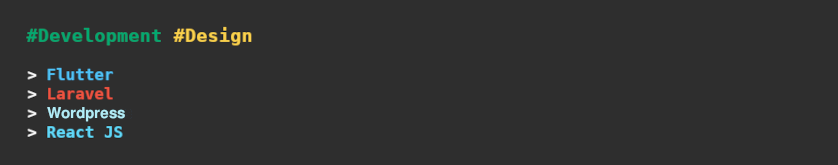

<!--  -->


### Hi there, I'm Hernie 

## Full Stack Software Developer 


[](https://komarev.com/ghpvc/?username=herndev&label=Profile%20views&color=0e75b6&style=for-the-badge)
[](https://hernie-jabien.com)


<!-- <br />

- 🔭 I’m currently working on some projects.
- 🌱 I’m currently learning new programming trends.
- 👯 I’m looking forward to collaborate with other teams.
- ⚡ Fun fact: I'm friendly and highly approachable.

<br /> -->


```
#DEVELOPMENT #DESIGN

> Flutter
> Laravel
> Wordpress
> React JS
```

### ✉️ Contact Me

[](mailto:herniejabien45@gmail.com)
[](https://facebook.com/dota500)
[](https://twitter.com/herndev)
[](https://instagram.com/hern.dev)
[](https://www.linkedin.com/in/hernie-jabien-6694aa155)

### ❤ Support Me

[](https://ko-fi.com/O5O6APHKJ)

 

<br />
 
 
<!-- <details>
  <summary style="font-size: 16px"> ℹ️ About Me</summary>

---

### Check out my portfolio click [here](https://www.hernie-jabien.com/).

```
For Web Development I work on frameworks like Wordpress, Laravel, Django, ReactJs and Vue.
In Mobile App Development I usually work with Flutter framework.
```

---

</details> -->

<details>
  <summary style="font-size: 16px"> ℹ️ Tech Tools & Workspace</summary>

---

### 🔥 Tech & Tools Preference

                      

### 💬 Other Languages I Know

    

### 💻 Workspace Spec


---

</details>

<details>
  <summary style="font-size: 16px"> 💻 Tech Updates & Memes</summary>

---

### 🎮 Game news for the hour

<!-- GAME:START -->
 - [Dragon&#39;s Dogma 10th anniversary website raises a lot of questions](https://www.pcgamer.com/dragons-dogma-10th-anniversary-website-raises-a-lot-of-questions)
 - [Thor: Love and Thunder’s new trailer shows off the retired god and his friends](https://www.polygon.com/23138688/thor-2-love-and-thunder-new-trailer-gorr-guardians-galaxy-cast)
 - [Destiny 2: Season 17 dungeon start time, new map, event cards, Iron Banner changes](https://www.pcgamer.com/destiny-2-season-17-start-time-new-map)<!-- GAME:END -->

### 💻 Tech news for the hour

<!-- TECH:START -->
 - [New Canon R7 and R10 Cameras Pair RF Lenses with APS-C Sensors     - CNET](https://www.cnet.com/tech/computing/new-canon-r7-and-r10-cameras-pair-rf-lenses-with-aps-c-sensors/#ftag=CAD590a51e)
 - [Nvidia turns to liquid cooling to reduce big tech’s energy use](https://www.theverge.com/2022/5/24/23138928/nvidia-liquid-cooling-a100-server-graphics-cards-computation-ai)
 - [More People Should Watch the 2nd Best Show on Netflix     - CNET](https://www.cnet.com/culture/entertainment/more-people-should-watch-the-2nd-best-show-on-netflix/#ftag=CAD590a51e)<!-- TECH:END -->

### 😂 Memes of the hour

<!-- MEMES:START -->
 - 💣 [Wrong day to wear a green t-shirt](http://9gag.com/gag/aQXrQQ7)
 - ⏩ [June is just around the corner! Run while you can!](http://9gag.com/gag/angdn0E)
 - 👉 [This really sucks a$](http://9gag.com/gag/apgdDLB)<!-- MEMES:END -->

---

</details>

<details>
  <summary style="font-size: 16px"> 📈 Github Status</summary>

---

<p align="left">
<!-- 
 -->
</p>

<!--START_SECTION:waka-->
<!--  -->


**I'm an Early 🐤** 

```text
🌞 Morning    247 commits    ██████████░░░░░░░░░░░░░░░   40.36% 
🌆 Daytime    173 commits    ███████░░░░░░░░░░░░░░░░░░   28.27% 
🌃 Evening    151 commits    ██████░░░░░░░░░░░░░░░░░░░   24.67% 
🌙 Night      41 commits     █░░░░░░░░░░░░░░░░░░░░░░░░   6.7%

```
📅 **I'm Most Productive on Wednesday** 

```text
Monday       43 commits     █░░░░░░░░░░░░░░░░░░░░░░░░   7.03% 
Tuesday      76 commits     ███░░░░░░░░░░░░░░░░░░░░░░   12.42% 
Wednesday    161 commits    ██████░░░░░░░░░░░░░░░░░░░   26.31% 
Thursday     34 commits     █░░░░░░░░░░░░░░░░░░░░░░░░   5.56% 
Friday       89 commits     ███░░░░░░░░░░░░░░░░░░░░░░   14.54% 
Saturday     145 commits    ██████░░░░░░░░░░░░░░░░░░░   23.69% 
Sunday       64 commits     ██░░░░░░░░░░░░░░░░░░░░░░░   10.46%

```


📊 **This Week I Spent My Time On** 

```text
⌚︎ Time Zone: Asia/Manila

💬 Programming Languages: 
JavaScript               10 hrs 51 mins      ████████████░░░░░░░░░░░░░   51.09% 
Dart                     3 hrs 32 mins       ████░░░░░░░░░░░░░░░░░░░░░   16.67% 
HTML                     3 hrs 15 mins       ███░░░░░░░░░░░░░░░░░░░░░░   15.35% 
CSS                      1 hr 56 mins        ██░░░░░░░░░░░░░░░░░░░░░░░   9.15% 
Markdown                 46 mins             █░░░░░░░░░░░░░░░░░░░░░░░░   3.67%

🔥 Editors: 
VS Code                  21 hrs 15 mins      █████████████████████████   100.0%

💻 Operating System: 
Linux                    21 hrs 15 mins      █████████████████████████   100.0%

```

**Timeline**

 


 Last Updated on 15/05/2022 02:03:30 UTC
<!--END_SECTION:waka-->

### ⚡️ Recent Activity

<!--START_SECTION:activity-->
1. 🎉 Merged PR [#1](https://github.com/herndev/herndev/pull/1) in [herndev/herndev](https://github.com/herndev/herndev)
2. 💪 Opened PR [#1](https://github.com/herndev/herndev/pull/1) in [herndev/herndev](https://github.com/herndev/herndev)
3. 🎉 Merged PR [#4](https://github.com/herndev/ReactJS-Portfolio/pull/4) in [herndev/ReactJS-Portfolio](https://github.com/herndev/ReactJS-Portfolio)
4. 🎉 Merged PR [#1](https://github.com/herndev/Trace-me/pull/1) in [herndev/Trace-me](https://github.com/herndev/Trace-me)
5. 🎉 Merged PR [#3](https://github.com/herndev/HLink/pull/3) in [herndev/HLink](https://github.com/herndev/HLink)
<!--END_SECTION:activity-->
 
---

</details>

<!--  -->

<!--  -->
