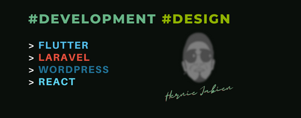

<!--  -->
<!-- |   HI THERE, I'M HERNIE     | -->

|   HI THERE     |
| ----------- |

[](https://git.io/typing-svg)

<br />

[](https://komarev.com/ghpvc/?username=herndev&label=Profile%20views&color=0e75b6&style=for-the-badge)
[](https://www.hernie-jabien.com)

|   SOFTWARE ENGINEER     |   GITHUB STATUS     |
| ----------- | ----------- |
|  |  |
<!-- 
|   CONTRIBUTION GRAPH      |
| ----------- |
|  |
 -->
|   RANDOM JOKE     |
| ----------- |

 

<details>
  <summary style="font-size: 16px"> 💻 Tech Updates & Memes</summary>

---

### 🎮 Game news for the hour

<!-- GAME:START -->
 - [Today&#39;s Wordle answer for Monday, December 30](https://www.pcgamer.com/games/puzzle/wordle-answer-today-december-30-2024/)
 - [Rule the talking movie industry in tycoon game Hollywood Animal](https://www.pcgamer.com/games/sim/rule-the-talking-movie-industry-in-tycoon-game-hollywood-animal/)
 - [Your Friendly Neighborhood Spider-Man’s first trailer is a blast from an alternate past](https://www.polygon.com/trailer/24216277/your-friendly-neighborhood-spider-man-trailer-premiere-date)<!-- GAME:END -->

### 💻 Tech news for the hour

<!-- TECH:START -->
 - [Elon Musk&#39;s new political influence may make it harder for regulators and politicians worldwide to resist Space X&#39;s Starlink, which added 20+ nations in 2024 &lpar;Bloomberg&rpar;](http://www.techmeme.com/241230/p10#a241230p10)
 - [The Most Dangerous People on the Internet in 2024](https://www.wired.com/story/the-most-dangerous-people-on-the-internet-in-2024/)
 - [Wish you could play PS1 games on a GBA SP? Well, now you can &lpar;sort of&rpar;.](https://www.androidauthority.com/miyoo-flip-launch-3511845/)<!-- TECH:END -->

### 😂 Memes of the hour

<!-- MEMES:START -->
 - 💣 [Never loose opportunity](http://9gag.com/gag/a5QXp6N)
 - ⏩ [What did he do?](http://9gag.com/gag/aVvbOpO)
 - 👉 [This is Dr. Donald Cline - A fertility doctor who illegally fathered 94 children - He discarded donated sperm &amp; replaced it with his own - He served a one-year suspended sentence for his atrocities](http://9gag.com/gag/aD2DBqN)<!-- MEMES:END -->

---

</details>


<details>
  <summary style="font-size: 16px"> 📈 Github Status</summary>

---

<!--START_SECTION:waka-->


**I'm a Night 🦉** 

```text
🌞 Morning                36802 commits       ███████░░░░░░░░░░░░░░░░░░   26.45 % 
🌆 Daytime                29985 commits       █████░░░░░░░░░░░░░░░░░░░░   21.55 % 
🌃 Evening                35695 commits       ██████░░░░░░░░░░░░░░░░░░░   25.66 % 
🌙 Night                  36630 commits       ███████░░░░░░░░░░░░░░░░░░   26.33 % 
```
📅 **I'm Most Productive on Thursday** 

```text
Monday                   16887 commits       ███░░░░░░░░░░░░░░░░░░░░░░   12.14 % 
Tuesday                  24876 commits       ████░░░░░░░░░░░░░░░░░░░░░   17.88 % 
Wednesday                26317 commits       █████░░░░░░░░░░░░░░░░░░░░   18.92 % 
Thursday                 28976 commits       █████░░░░░░░░░░░░░░░░░░░░   20.83 % 
Friday                   25083 commits       █████░░░░░░░░░░░░░░░░░░░░   18.03 % 
Saturday                 12637 commits       ██░░░░░░░░░░░░░░░░░░░░░░░   09.08 % 
Sunday                   4336 commits        █░░░░░░░░░░░░░░░░░░░░░░░░   03.12 % 
```


📊 **This Week I Spent My Time On** 

```text
🕑︎ Time Zone: Asia/Manila

💬 Programming Languages: 
Dart                     5 hrs 27 mins       █████████████░░░░░░░░░░░░   52.46 % 
PHP                      2 hrs 11 mins       █████░░░░░░░░░░░░░░░░░░░░   21.05 % 
JavaScript               53 mins             ██░░░░░░░░░░░░░░░░░░░░░░░   08.57 % 
YAML                     27 mins             █░░░░░░░░░░░░░░░░░░░░░░░░   04.48 % 
Bash                     20 mins             █░░░░░░░░░░░░░░░░░░░░░░░░   03.27 % 

🔥 Editors: 
VS Code                  10 hrs 24 mins      █████████████████████████   100.00 % 

💻 Operating System: 
Windows                  9 hrs 55 mins       ████████████████████████░   95.35 % 
Mac                      29 mins             █░░░░░░░░░░░░░░░░░░░░░░░░   04.65 % 
```

**Timeline**


 Last Updated on 30/12/2024 01:10:37 UTC
<!--END_SECTION:waka-->

### ⚡️ Recent Activity

<!--START_SECTION:activity-->
1. 🎉 Merged PR [#1](https://github.com/herndev/hydra/pull/1) in [herndev/hydra](https://github.com/herndev/hydra)
2. 💪 Opened PR [#1](https://github.com/herndev/hydra/pull/1) in [herndev/hydra](https://github.com/herndev/hydra)
3. ❗️ Opened issue [#35852](https://github.com/timburgan/timburgan/issues/35852) in [timburgan/timburgan](https://github.com/timburgan/timburgan)
4. ❗️ Opened issue [#248](https://github.com/JohnyP36/Connect4/issues/248) in [JohnyP36/Connect4](https://github.com/JohnyP36/Connect4)
5. ❗️ Opened issue [#35842](https://github.com/timburgan/timburgan/issues/35842) in [timburgan/timburgan](https://github.com/timburgan/timburgan)
<!--END_SECTION:activity-->

---

</details>

<br />
<div align="center">
	
</div>

