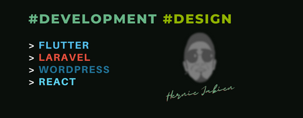

<!--  -->
<!-- |   HI THERE, I'M HERNIE     | -->

|   HI THERE     |
| ----------- |

[](https://git.io/typing-svg)

<br />

[](https://komarev.com/ghpvc/?username=herndev&label=Profile%20views&color=0e75b6&style=for-the-badge)
[](https://herndev.vercel.app)

|   SOFTWARE ENGINEER     |   GITHUB STATUS     |
| ----------- | ----------- |
|  | [](https://git.io/streak-stats) |
<!-- 
|   CONTRIBUTION GRAPH      |
| ----------- |
|  |
 -->
|   RANDOM JOKE     |
| ----------- |

 

<details>
  <summary style="font-size: 16px"> 💻 Tech Updates & Memes</summary>

---

### 🎮 Game news for the hour

<!-- GAME:START -->
 - [Your dad&#39;s favorite show might become a videogame](https://www.pcgamer.com/movies-tv/your-dads-favorite-show-might-become-a-videogame/)
 - [Microsoft doesn&#39;t know what to do about the memory pricing crisis Microsoft is causing](https://www.pcgamer.com/software/platforms/microsoft-doesnt-know-what-to-do-about-the-memory-pricing-crisis-microsoft-is-causing/)
 - [While you&#39;re waiting for Valheim 1.0, why not try this map that transforms it into a massive RPG?](https://www.pcgamer.com/games/survival-crafting/while-youre-waiting-for-valheim-1-0-why-not-try-this-map-that-transforms-it-into-a-massive-rpg/)<!-- GAME:END -->

### 💻 Tech news for the hour

<!-- TECH:START -->
 - [Samsung reports Q2 revenue up 130% YoY to ~$118.1B, vs. ~$118.9B est., and operating profit up 1,814% to ~$61.46B, vs. ~$60.68B est., on robust AI demand &lpar;Jenny Lee/CNBC&rpar;](https://www.techmeme.com/260729/p49#a260729p49)
 - [Mark Zuckerberg Is Putting All His Chips on an AI Future, Whether You Want It or Not](https://www.cnet.com/tech/services-and-software/mark-zuckerberg-meta-earnings-call-big-ai-investment/)
 - [Microsoft reports Q4 capex up 70% YoY to $41B; an accounting change lowers its 2026 capex forecast to $175B from $190B, while spending plans remain unchanged &lpar;Reuters&rpar;](https://www.techmeme.com/260729/p48#a260729p48)<!-- TECH:END -->

### 😂 Memes of the hour

<!-- MEMES:START -->
 - 💣 [One our local strip clubs](https://www.reddit.com/r/funny/comments/1vaez7q/one_our_local_strip_clubs/)
 - ⏩ [He was a little angry](http://9gag.com/gag/agmPKqv)
 - 👉 [Katy Perry&#39;s fans deliberately ruins her concert entry by carrying her away the wrong direction](http://9gag.com/gag/aE0LOgG)<!-- MEMES:END -->

---

</details>


<details>
  <summary style="font-size: 16px"> 📈 Github Status</summary>

---

<!--START_SECTION:waka-->


**I'm a Night 🦉** 

```text
🌞 Morning                40494 commits       ███████░░░░░░░░░░░░░░░░░░   26.29 % 
🌆 Daytime                33155 commits       █████░░░░░░░░░░░░░░░░░░░░   21.52 % 
🌃 Evening                39594 commits       ██████░░░░░░░░░░░░░░░░░░░   25.70 % 
🌙 Night                  40795 commits       ███████░░░░░░░░░░░░░░░░░░   26.48 % 
```
📅 **I'm Most Productive on Thursday** 

```text
Monday                   18774 commits       ███░░░░░░░░░░░░░░░░░░░░░░   12.19 % 
Tuesday                  27902 commits       █████░░░░░░░░░░░░░░░░░░░░   18.11 % 
Wednesday                29276 commits       █████░░░░░░░░░░░░░░░░░░░░   19.01 % 
Thursday                 31892 commits       █████░░░░░░░░░░░░░░░░░░░░   20.70 % 
Friday                   28080 commits       █████░░░░░░░░░░░░░░░░░░░░   18.23 % 
Saturday                 13767 commits       ██░░░░░░░░░░░░░░░░░░░░░░░   08.94 % 
Sunday                   4347 commits        █░░░░░░░░░░░░░░░░░░░░░░░░   02.82 % 
```


📊 **This Week I Spent My Time On** 

```text
🕑︎ Time Zone: Asia/Manila

💬 Programming Languages: 
Blade Template           4 hrs 32 mins       ███████████░░░░░░░░░░░░░░   42.84 % 
PHP                      4 hrs 24 mins       ██████████░░░░░░░░░░░░░░░   41.62 % 
Markdown                 42 mins             ██░░░░░░░░░░░░░░░░░░░░░░░   06.67 % 
Bash                     32 mins             █░░░░░░░░░░░░░░░░░░░░░░░░   05.15 % 
JavaScript               18 mins             █░░░░░░░░░░░░░░░░░░░░░░░░   02.87 % 

🔥 Editors: 
VS Code                  10 hrs 35 mins      █████████████████████████   100.00 % 

💻 Operating System: 
Mac                      10 hrs 10 mins      ████████████████████████░   96.15 % 
Linux                    24 mins             █░░░░░░░░░░░░░░░░░░░░░░░░   03.85 % 
```

**Timeline**


 Last Updated on 27/04/2025 01:01:51 UTC
<!--END_SECTION:waka-->

### ⚡️ Recent Activity

<!--START_SECTION:activity-->
1. ❗️ Closed issue [#7163](https://github.com/marcizhu/marcizhu/issues/7163) in [marcizhu/marcizhu](https://github.com/marcizhu/marcizhu)
2. ❗️ Opened issue [#7163](https://github.com/marcizhu/marcizhu/issues/7163) in [marcizhu/marcizhu](https://github.com/marcizhu/marcizhu)
3. ❗️ Closed issue [#7158](https://github.com/marcizhu/marcizhu/issues/7158) in [marcizhu/marcizhu](https://github.com/marcizhu/marcizhu)
4. ❗️ Opened issue [#7158](https://github.com/marcizhu/marcizhu/issues/7158) in [marcizhu/marcizhu](https://github.com/marcizhu/marcizhu)
5. ❗️ Closed issue [#7157](https://github.com/marcizhu/marcizhu/issues/7157) in [marcizhu/marcizhu](https://github.com/marcizhu/marcizhu)
<!--END_SECTION:activity-->

---

</details>

<br />
<div align="center">
	
</div>

